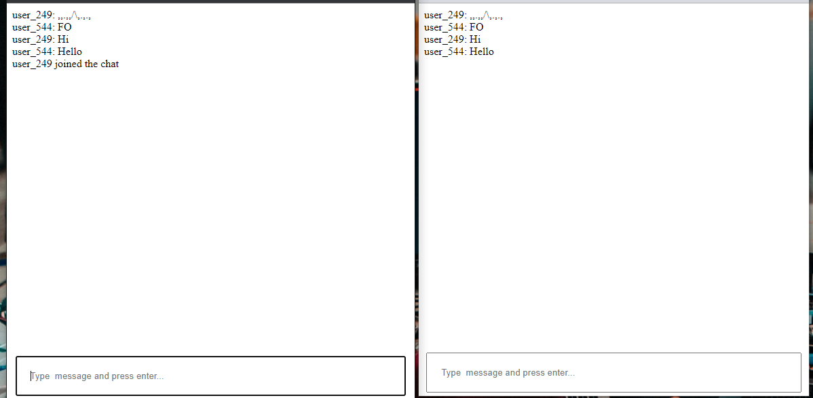

# Notes (SERVER)

- Install dependencies - `composer install`
- Create `src/socket.php`

```php
<?php

namespace App;

use Ratchet\MessageComponentInterface;
use Ratchet\ConnectionInterface;

class Socket implements MessageComponentInterface {

    public function __construct()
    {
        $this->clients = new \SplObjectStorage;
    }

    public function onOpen(ConnectionInterface $conn) 
    {
        ....
    }

    public function onMessage(ConnectionInterface $from, $msg) 
    {
        ....
    }

    public function onClose(ConnectionInterface $conn) 
    {
        ....
    }

    public function onError(ConnectionInterface $conn, \Exception $e) 
    {
        ....
    }
}
```

- Create `run` php bash script - Executable in CLI

```php
#!/usr/bin/env php

<?php

use Ratchet\Server\IoServer;
use Ratchet\Http\HttpServer;
use Ratchet\WebSocket\WsServer;
use App\Socket;

require dirname( __FILE__ ) . '/vendor/autoload.php';

$server = IoServer::factory(
    new HttpServer(
        new WsServer(
            new Socket()
        )
    ),
    8088 // <--------------------------
);

$server->run();
```

- **NB** Run script using **CLI - Command Prompt** (Security measures)
- RUN `php run` to launch local web socket server
---


# Notes (CLIENT)

```js

// Create a new WebSocket.

//var socket  = new WebSocket('ws://127.0.0.1:8088');
var socket  = new WebSocket("ws://192.168.100.XX:8088");

var message = document.getElementById('message');

function transmitMessage() {
    socket.send( message.value );
}

socket.onmessage = function(e) {
    alert( e.data );
}
```

URL : http://localhost/websocket/ - use local tunnel / ngrok (Will work on same network)

